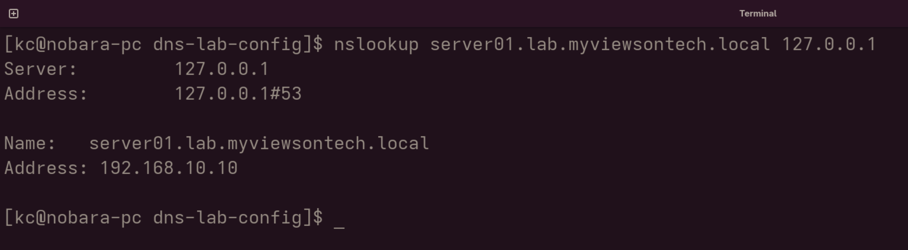
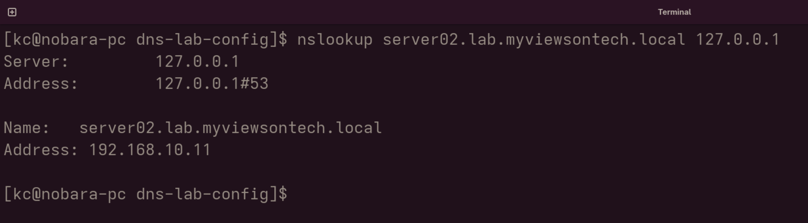
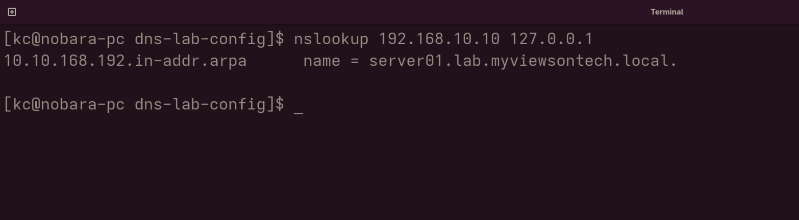
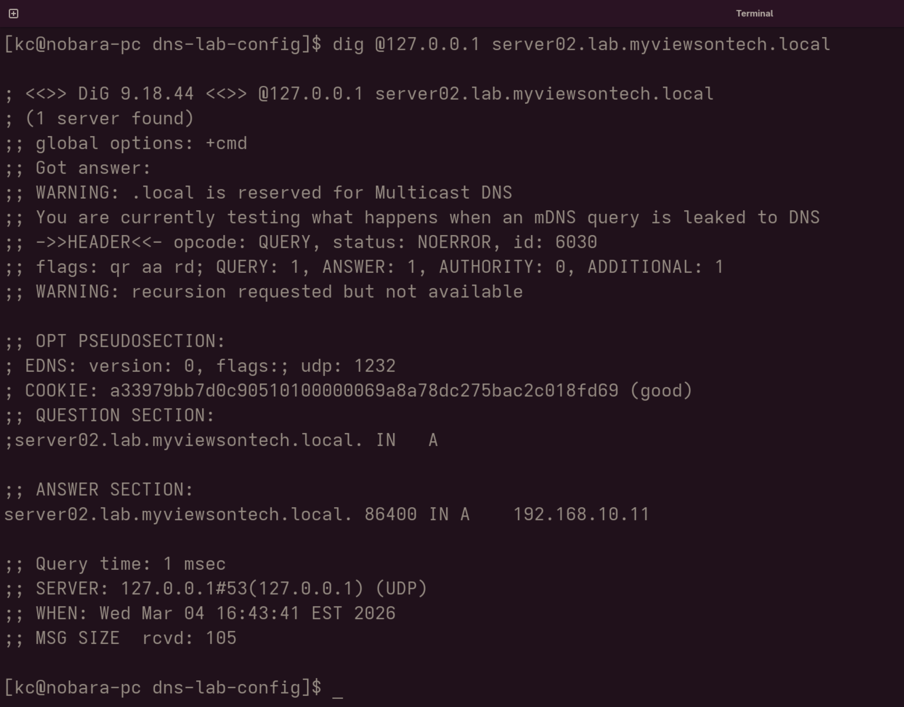

# dns-lab-config

Configured a BIND9 DNS server with forward and reverse lookup zones 
for a simulated lab network. Verified correct name resolution 
using nslookup and dig across multiple subnets.

## Structure
- `docker-compose.yml` — spins up BIND9 container
- `config/named.conf` — DNS server configuration
- `config/zones/lab.myviewsontech.local.zone` — forward lookup zone
- `config/zones/reverse.zone` — reverse lookup zone

## Usage
```bash
docker compose up -d
```

## Verification
```bash
# Forward lookup
nslookup server01.lab.myviewsontech.local 127.0.0.1

# Reverse lookup  
nslookup 192.168.10.10 127.0.0.1

# Using dig
dig @127.0.0.1 server02.lab.myviewsontech.local
```

## Skills Demonstrated
- DNS server configuration (BIND9)
- Forward and reverse lookup zones
- Lab network name resolution
- Containerised infrastructure setup

## Verification Output






